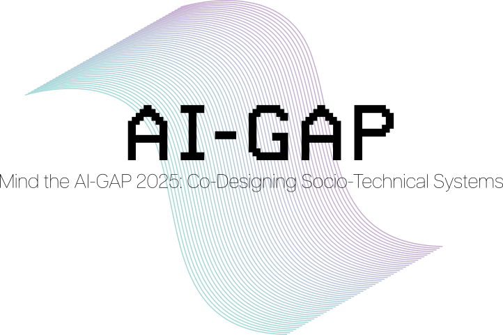

## Mind the AI-GAP 2025: Co-Designing Socio-Technical Systems 

### Colocated with <a href="https://hhai-conference.org/2025/" target="_blank">HHAI 2025</a>: The 4th International Conference Series on Hybrid Human-Artificial Intelligence (June 9-13, 2025 in Pisa, Italy)

This workshop is set out to critically identify risks and limitations in AI-powered technologies while fostering reflection on their development and impact through the use of structured co-design methodologies. It aims to bring together diverse contributions and practices to explore how participatory processes can integrate community values into the co-design of socio-technical systems. Through a combination of talks, roundtable discussions, and hands-on activities, participants will collaborate to produce actionable outputs such as guidelines, a white paper, or design artifacts. The event ultimately intends to foster interdisciplinary engagement and move beyond academia to include practitioners, NGOs, and designers, experimenting a robust, society-centered approach to AI development, assessment, and deployment.

### Important Dates (Time zone: Anywhere on Earth)
* Submission deadline: 7 April, 2025
* Notification of acceptance: 2 May, 2025
* Camera Ready due: 12 May, 2025
* Workshop: 9 June 2025 in Pisa, Italy

### Workshop Organizers

Costanza Alfieri, Università dell’Aquila

Eleonora Cappuccio, Consiglio Nazionale delle Ricerche

Donatella Donati, Università dell’Aquila

Miriam Felici, Digital Product Designer  

Marta Marchiori Manerba, Università di Pisa

Benedetta Muscato, Scuola Normale Superiore

Clara Punzi, Scuola Normale Superiore 

Beatrice Savoldi, Fondazione Bruno Kessler 

